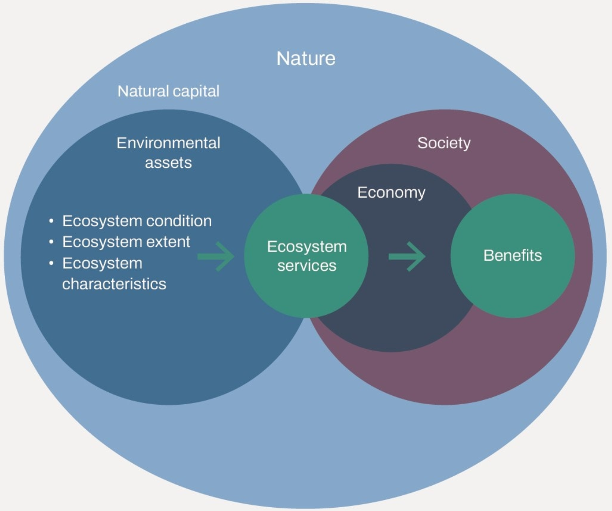
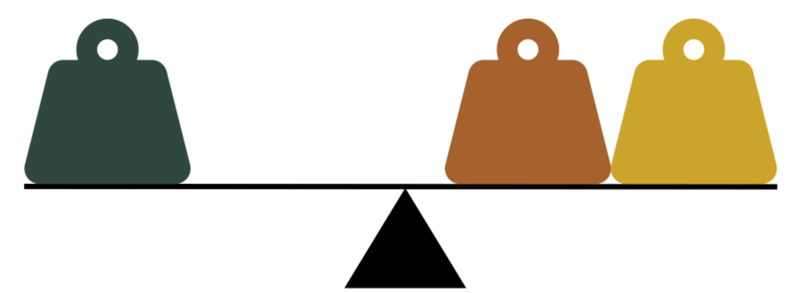
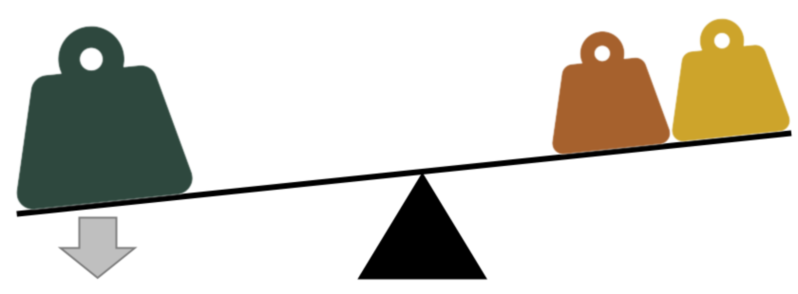
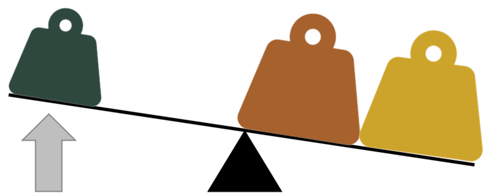

```{r setup, include=FALSE}
knitr::opts_chunk$set(echo = FALSE)

# Rscript -e "rmarkdown::render('bq_markdown_template.Rmd')"
# sudo Rscript -e "pak::pak('pagedown'); options(pagedown.remote.maxattempts=40); pagedown::chrome_print('bq_markdown_template.html',output=
'bq_markdown_template.pdf')"
```

class: title-slide

.title[Assessing the Financial Sector’s Impact on Biodiversity with Local Indicators]

.instructors[Victor Cameron]

.institution[Université de Sherbrooke]

.title-page-logo1[]
.title-page-logo2[]
.title-page-logo3[]


---

# Finance and Biodiversity

.pull-left[

  ## The financial sector’s role in the biodiversity crisis

  Dependencies, impacts, risks & opportunities

<br>
  ## The importance of measuring and the initiatives to disclose financial impacts on nature

  - TNFD (Taskforce on Nature-related Financial Disclosures)
  - CSRD (Corporate Sustainability Reporting Directive)

  <!--  1. La place du secteur de l'investissement dans la crise de la biodiversité
        1. Des frameworks internationaux, entrent en régulation en EU : 
           1. TNFD (Taskforce on Nature-related Financial Disclosures): Recommendations for nature-related disclosures
           2. CSRD (Corporate Sustainability Reporting Directive): EU rules require large compagnies to report on their impact
           3. 
        2. Comment intégrer la biodiversité dans les décisions financières au Québec ?
        3. Consultation with Quebec investors = absence of local indicators -->
]

.pull-right[<br>] <!-- Insert image from https://tnfd.global/wp-content/uploads/2023/09/22-22529-TNFD-Main-Diagrams_v4-27-1.jpg -->

.cite[TNFD. 2023]

---

# Global Frameworks, Local Blind Spots

<br><br>
<!-- Partnership between Université de Sherbrooke, SNAP Québec, Fondaction, and CDPQ = development of a local pre-investment tool (indicators) -->

.center[]

---

# Bridging the Gap: Data, Literacy, Relevance

<br>
.conteneur-box[
  .box[
  .center[**Data availability and accessibility**]
  <br>
  .center[<svg xmlns="http://www.w3.org/2000/svg" viewBox="0 0 448 512" style="height:4em;position:relative;display:inline-block;top:.1em;fill:#000000;"><path d="M448 80l0 48c0 44.2-100.3 80-224 80S0 172.2 0 128L0 80C0 35.8 100.3 0 224 0S448 35.8 448 80zM393.2 214.7c20.8-7.4 39.9-16.9 54.8-28.6L448 288c0 44.2-100.3 80-224 80S0 332.2 0 288L0 186.1c14.9 11.8 34 21.2 54.8 28.6C99.7 230.7 159.5 240 224 240s124.3-9.3 169.2-25.3zM0 346.1c14.9 11.8 34 21.2 54.8 28.6C99.7 390.7 159.5 400 224 400s124.3-9.3 169.2-25.3c20.8-7.4 39.9-16.9 54.8-28.6l0 85.9c0 44.2-100.3 80-224 80S0 476.2 0 432l0-85.9z"/></svg>]
  <br>
  Methodology should be published and reviewed by experts
  ]
  .box[
  .center[**Limited biodiversity literacy**]
  <br>
  .center[<svg xmlns="http://www.w3.org/2000/svg" viewBox="0 0 576 512" style="height:4em;position:relative;display:inline-block;top:.1em;fill:#000000;"><path d="M249.6 471.5c10.8 3.8 22.4-4.1 22.4-15.5l0-377.4c0-4.2-1.6-8.4-5-11C247.4 52 202.4 32 144 32C93.5 32 46.3 45.3 18.1 56.1C6.8 60.5 0 71.7 0 83.8L0 454.1c0 11.9 12.8 20.2 24.1 16.5C55.6 460.1 105.5 448 144 448c33.9 0 79 14 105.6 23.5zm76.8 0C353 462 398.1 448 432 448c38.5 0 88.4 12.1 119.9 22.6c11.3 3.8 24.1-4.6 24.1-16.5l0-370.3c0-12.1-6.8-23.3-18.1-27.6C529.7 45.3 482.5 32 432 32c-58.4 0-103.4 20-123 35.6c-3.3 2.6-5 6.8-5 11L304 456c0 11.4 11.7 19.3 22.4 15.5z"/></svg>]
  <br>
  Users have varying level of familiarity with biodiversity concepts
  ]
  .box[
  .center[**Global indicators are maladapted**]
  <br>
  .center[<svg xmlns="http://www.w3.org/2000/svg" viewBox="0 0 512 512" style="height:4em;position:relative;display:inline-block;top:.1em;fill:#000000;"><path d="M57.7 193l9.4 16.4c8.3 14.5 21.9 25.2 38 29.8L163 255.7c17.2 4.9 29 20.6 29 38.5l0 39.9c0 11 6.2 21 16 25.9s16 14.9 16 25.9l0 39c0 15.6 14.9 26.9 29.9 22.6c16.1-4.6 28.6-17.5 32.7-33.8l2.8-11.2c4.2-16.9 15.2-31.4 30.3-40l8.1-4.6c15-8.5 24.2-24.5 24.2-41.7l0-8.3c0-12.7-5.1-24.9-14.1-33.9l-3.9-3.9c-9-9-21.2-14.1-33.9-14.1L257 256c-11.1 0-22.1-2.9-31.8-8.4l-34.5-19.7c-4.3-2.5-7.6-6.5-9.2-11.2c-3.2-9.6 1.1-20 10.2-24.5l5.9-3c6.6-3.3 14.3-3.9 21.3-1.5l23.2 7.7c8.2 2.7 17.2-.4 21.9-7.5c4.7-7 4.2-16.3-1.2-22.8l-13.6-16.3c-10-12-9.9-29.5 .3-41.3l15.7-18.3c8.8-10.3 10.2-25 3.5-36.7l-2.4-4.2c-3.5-.2-6.9-.3-10.4-.3C163.1 48 84.4 108.9 57.7 193zM464 256c0-36.8-9.6-71.4-26.4-101.5L412 164.8c-15.7 6.3-23.8 23.8-18.5 39.8l16.9 50.7c3.5 10.4 12 18.3 22.6 20.9l29.1 7.3c1.2-9 1.8-18.2 1.8-27.5zM0 256a256 256 0 1 1 512 0A256 256 0 1 1 0 256z"/></svg>]
  <br>
  Chosen indicators must be relevant to the local context of Québec
  ]
]

---
background-image: url("assets/img/bellevue.png")
background-size: cover

# A Case Study: Impact of Habitat Loss

<!-- 1. Présentation du Mont Bellevue
  - Parc du Mont-Bellevue : réserve naturelle universitaire
  - ~200 Ha 
  - Entouré d'un paysage urbain
  - Majoritaire forestier, avec milieux humides et hydriques
-->

<!-- .center[] -->

.cite[Image by Google Earth. 2024.]

---
background-image: url("assets/img/bellevue.png")
background-size: cover


# A Case Study: Impact of Habitat Loss

.box[
.center[## From the scientific perspective]
The indicator must include the following
  - **Ecological habitat value**: the habitats' usage by species
  - **Regional rarity**: the proportion of the habitat types in the region
  - **Surface area**: the loss of surfaces equivalent to essential habitat sizes
]

--

.box[
.center[## From the users perspective]
The indicator must be
  - **Understandable**: a score easy to interpret
  - **Relevant**: the indicator must be meaningful for the user
  - **Actionable**: the indicator must be able to guide decision-making

All indicators will be presented as a score between 0 and 1,  along supplementary information.
]

---

# A Case Study: Impact of Habitat Loss

## Quantifying Ecological habitat value

**Value index**: The habitats' usage by species

$$\textbf{Value index} = \frac{N_h}{N}$$

.small[
| Species                | Forests | Wetlands | Grasslands | Croplands | Urban |
|:---------------------- |:-------:|:--------:|:----------:|:---------:|:-----:|
| 🐀 *Blarina brevicauda*| X       |          |            |           |       |
| 🦦 *Martes americana*  | X       |          |            |           |       |
| 🦎 *Plethodon cinereus*| X       |          |            |           |       |
| 🐸 *Rana sylvatica*    | X       | X        |            |           |       |
| 🐻 *Ursus americanus*  | X       | X        |            |           |       |
| **Value index**        | **1**   | **0.4**  | **0**      | **0**     | **0** |
]

.cite[Adapted from Albert et al. 2017]

---

# A Case Study: Impact of Habitat Loss

## Quantifying Regional rarity

**Rarity index**: one minus the regional frequency of the habitat type

$$\textbf{Rarity index} = 1 - \text{Regional frequency}$$

| Habitat type | Regional freq. | **Rarity index** |
|--------------|:--------------:|:----------:|
| Forests      | 0.78           | **0.224**  |
| Wetlands     | 0.004          | **0.996**  |
| Grasslands   | 0.0007         | **0.999**  |
| Croplands    | 0.15           | **0.853**  |
| Urban        | 0.05           | **0.951**  |

.cite[AAFC. 2024]

---

# A Case Study: Impact of Habitat Loss

## Quantifying Surface area

**Area index**: the loss of surfaces greather than minimum essential habitat sizes

$$\textbf{Area index} = \frac{N_{H_e < H}}{N}$$

Where $H_e$ is the essential habitat size for the species and $H$ is the habitat area

| Species                | $H_e$ (ha) | $H$ (ha) | Loss of essential habitat |
|:---------------------- |:----------:|:--------:|:------------------------:|
| 🐀 *Blarina brevicauda*| 1          | 170.9    | 1                        |
| 🦦 *Martes americana*  | 150        | 170.9    | 1                        |
| 🦎 *Plethodon cinereus*| 0.27       | 170.9    | 1                        |
| 🐸 *Rana sylvatica*    | 0.5        | 171.4    | 1                        |
| 🐻 *Ursus americanus*  | 1200       | 171.4    | 0                        |
| **Area index**         |            |          | **0.8**                  |


.cite[Adapted from Albert et al. 2017]

<!-- https://quebio.ca/sites/default/files/reports/Modelisation_connectivite_btsl_juillet2021.pdf -->

---

# A Case Study: Impact of Habitat Loss

## Bringing it all together

Weighted average of the Ecological habitat values

$$\textbf{Habitat destruction indicator} = \frac{\sum \color{#2e483e}{Value_{i}} * \color{#a6612d}{Rarity_{i}} * \color{#cda42b}{Area_{i}}}{\sum {\color{#a6612d}{Rarity_{i}} * \color{#cda42b}{Area_{i}}}}$$

---

# A Case Study: Impact of Habitat Loss

## Bringing it all together

Weighted average of the habitat's value

$$\textbf{Habitat destruction indicator} = \frac{\sum \color{#2e483e}{Value_{i}} * \color{#a6612d}{Rarity_{i}} * \color{#cda42b}{Area_{i}}}{\sum {\color{#a6612d}{Rarity_{i}} * \color{#cda42b}{Area_{i}}}}$$

<br><br>
.center[]

---

# A Case Study: Impact of Habitat Loss

## Bringing it all together

Weighted average of the habitat's value

$$\textbf{Habitat destruction indicator} = \frac{\sum \color{#2e483e}{Value_{i}} * \color{#a6612d}{Rarity_{i}} * \color{#cda42b}{Area_{i}}}{\sum {\color{#a6612d}{Rarity_{i}} * \color{#cda42b}{Area_{i}}}}$$

<br><br>
.center[]

---

# A Case Study: Impact of Habitat Loss

## Bringing it all together

Weighted average of the habitat's value

$$\textbf{Habitat destruction indicator} = \frac{\sum \color{#2e483e}{Value_{i}} * \color{#a6612d}{Rarity_{i}} * \color{#cda42b}{Area_{i}}}{\sum {\color{#a6612d}{Rarity_{i}} * \color{#cda42b}{Area_{i}}}}$$

<br><br>
.center[]


---

# A Case Study: Impact of Habitat Loss

## Bringing it all together

$$\textbf{Habitat destruction indicator} = \frac{\sum \color{#2e483e}{Value_{i}} * \color{#a6612d}{Rarity_{i}} * \color{#cda42b}{Area_{i}}}{\sum {\color{#a6612d}{Rarity_{i}} * \color{#cda42b}{Area_{i}}}}$$
<br><br>

| Habitat type | Value index | Rarity index | Area index |
|--------------|:-----:|:------:|:----:|
| Forests      | 1     | 0.224  | 0.8    |
| Wetlands     | 0.4   | 0.996  | 0.8    |
| Grasslands   | 0     | 0.999  | 0.8    |
| Croplands    | 0     | 0.853  | 0.8    |
| Urban        | 0     | 0.951  | 0.8    |

---

# A Case Study: Impact of Habitat Loss

## Bringing it all together

<br>
$$\textbf{Habitat destruction indicator} = 0.51$$
<br><br>

| Habitat type | Value index | Rarity index | Area index |
|--------------|:-----:|:------:|:----:|
| Forests      | 1     | 0.224  | 0.8    |
| Wetlands     | 0.4   | 0.996  | 0.8    |
| Grasslands   | 0     | 0.999  | 0.8    |
| Croplands    | 0     | 0.853  | 0.8    |
| Urban        | 0     | 0.951  | 0.8    |

---

# A Local Biodiversity Finance Tool

## 9 indicators to assess the impact of investments on biodiversity

<br>
.center[]

---

# The Path Forward

## Integrating Biodiversity into Finance

These challenges required an **iterative development process** and **close collaboration between biodiversity experts and users**.

.center[]

---

# Reach out!

<br>
<br>
## Victor Cameron
.small[Eco-informatician, lecturer ]

.vertforet[victor.cameron@usherbrooke.ca] <br>
.vertforet[www.biodiversite-quebec.ca]

<br><br><br>
.pull-left[
.pull-left[]
.pull-right[]
]
.pull-right[
.pull-left[]
.pull-right[]
]